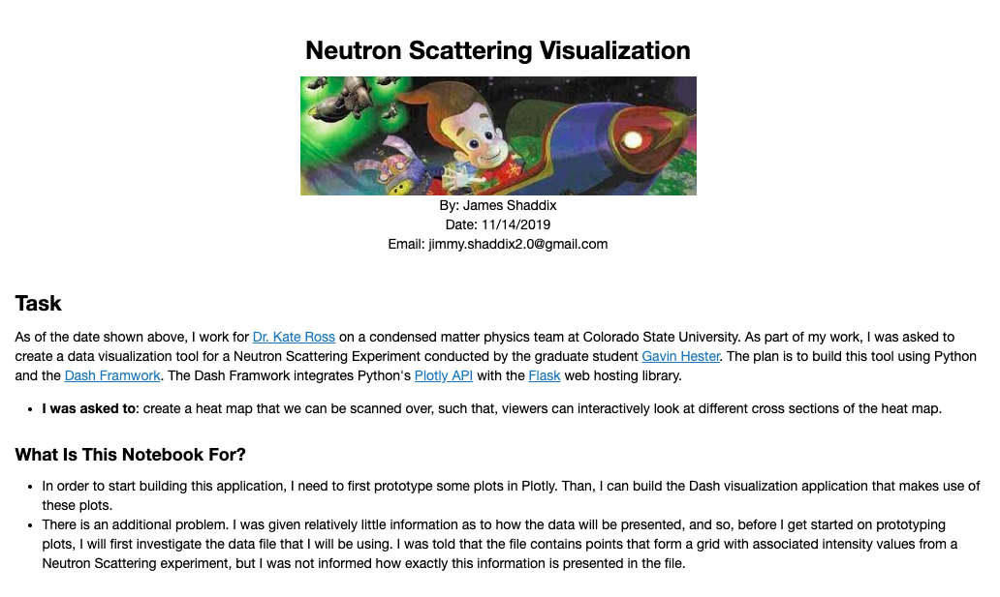

# Neutron-Scattering-Dashboard
Dashboard application displaying Neutron Scattering data for [Dr. Kate Ross's web site](http://www.rosslabcsu.com/).

You can see the application live [here](http://3.234.168.156/).
 
## Dash Application:


## Description:
This repository contains code for generating a dashboard application
that displays data from a [neutron scattering](https://en.wikipedia.org/wiki/Neutron_scattering)
experiment.

This dashboard application was built using Python's [Dash Framework](https://plot.ly/dash/). 
The application allows for users to sweep across a heat map that displays 
Neutron Intensities that were recieved during an experiment. As you 
sweep across the heatmap, a plot is updated that displays data associated
with the current cross section of the data that the user picked out.

## Prototyping
If you are interested in seeing what considerations went into how I handled the data, or 
what kind of data is handled by this application, you can read the [jupyter notebook](plots/plots.ipynb)
that I generated for prototyping this dashboard.


## Dependencies
* python3.7
* Third party python libraries listed in **requirements.txt**

## Installation Instructions

1. Clone the repo
```Bash
git clone https://github.com/Jim-Shaddix/Personal-Website.git
```
2. You can than use the following command to download all the third party libraries
needed to run this program.
```Bash
pip install -r requirements.txt
```
3. Run the application!
```Bash
python app.py
```

#### Files
* main.py: contains code for running the application.
* Dtabs.py: contains code for generating the ``Description`` and ``Graph`` tabs.
* layout.py: contains layouts for the surface and scatter plots for the data.

## Citations
* The code for the tab bar (as well as the CSS colorscheme I used for the website) was largely 
based on (or taken from) the code examples in the [dash-bio repository](https://github.com/plotly/dash-bio/blob/master/tests/test_manhattan_plot.py).