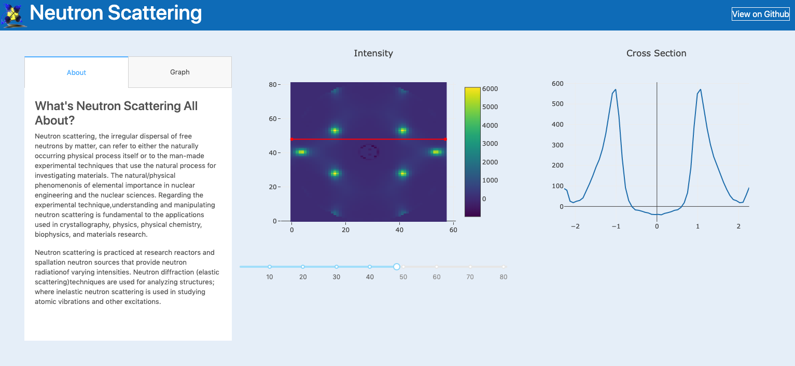

# Note: 
This application is currently in development!

# Neutron-Scattering-Dashboard
Dashboard application displaying Neutron Scattering data for [Dr. Kate Ross's web site](http://www.rosslabcsu.com/).
 
## Dash Application:


## Description:
This repository contains code for generating a dashboard application
that displays graph's assocaited with [neurtron scattering][https://en.wikipedia.org/wiki/Neutron_scattering] 
experiments.

This dashboard application was built using Python's dash library. 
It allows for the user to sweep across a heat map that displays 
Neutron Intensities that were recieved during an experiment. As you 
sweep across the heatmap, a plot is updated that displays data associated
with the current cross section. 

## Tab Bar and Colorscheme Citation
* The code for the tab bar (as well as the CSS colorscheme I used) was largely 
based on (or taken from) the code examples in the [dash-bio repository](https://github.com/plotly/dash-bio/blob/master/tests/test_manhattan_plot.py).
 
### Dependencies

#### Application / Plot Dependencies
```Bash
pip install dash==1.0.0  # The core dash backend
pip install dash-daq==0.1.0  # DAQ components (newly open-sourced!)
pip install dash-bootstrap-components==0.6.3 # dash bootstrap components
pip install plotly==3.4.2  # plotly graphs
```
#### General Dependencies
```Bash
pip install numpy==1.15.4
pip install pandas==0.23.4
```

#### Files
* main.py: contains code for running the application.
* Dtabs.py: contains code for generating the ``Description`` and ``Graph`` tabs.
* graphs.py: generates surface and scatter plots for the data.

